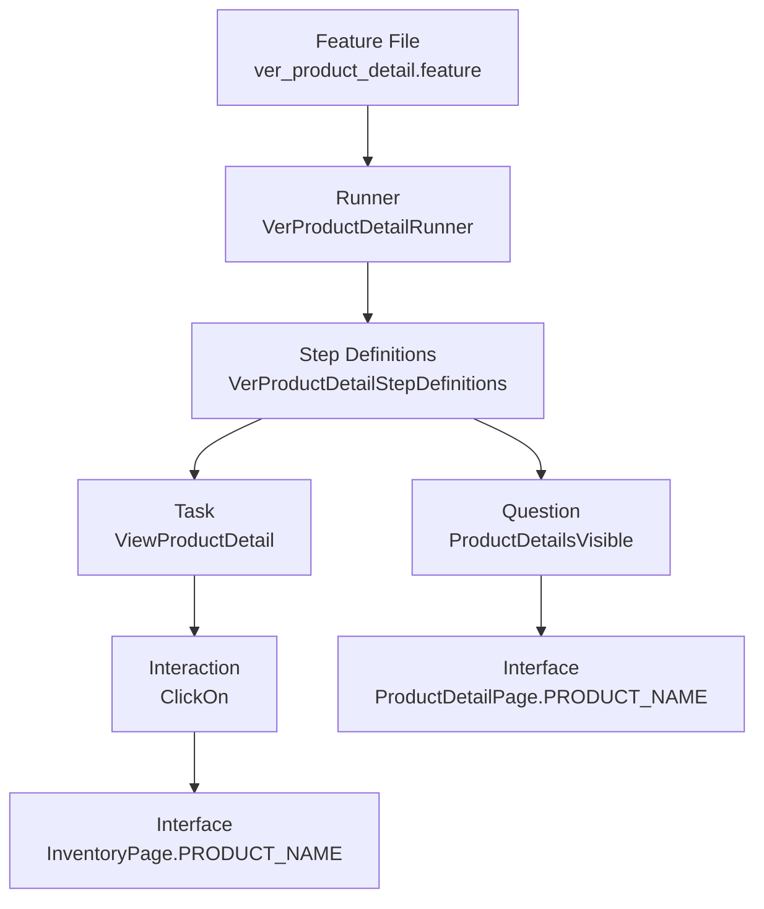

# Resumen y Proceso de Explicación del Código de Pruebas

Este documento proporciona un resumen de la arquitectura del proyecto de automatización y una guía paso a paso para entender y exponer el flujo de las pruebas.

## 1. Resumen de la Arquitectura

El proyecto utiliza **Serenity BDD** con **Cucumber** y sigue el patrón de diseño **Screenplay**. Este patrón se centra en los actores y sus interacciones con el sistema, haciendo que las pruebas sean más legibles y mantenibles.

### Estructura de Directorios (`src/test/java/org/calidadsoftware`)

| Directorio | Propósito | Ejemplo |
|------------|-----------|---------|
| **`runners`** | Punto de entrada para ejecutar las pruebas | `VerProductDetailRunner.java` |
| **`stepdefinitions`** | Traduce los pasos de Gherkin (Given, When, Then) a código Java | `VerProductDetailStepDefinitions.java` |
| **`tasks`** | Acciones de alto nivel que realiza el actor (el "cómo" del negocio) | `ViewProductDetail`, `Login` |
| **`questions`** | Verificaciones del estado del sistema (Asserts) | `ProductDetailsVisible` |
| **`interfaces`** | Mapeo de elementos web (Targets/PageObjects) con selectores | `ProductDetailPage`, `InventoryPage` |
| **`interactions`** | Acciones de bajo nivel personalizadas (clics, escribir texto) | `ClickOn` |
| **`drivers`** | Configuración del navegador (WebDriver) | `DriverFactory` |

### Recursos (`src/test/resources`)

| Directorio | Contenido |
|------------|-----------|
| **`features`** | Archivos `.feature` con escenarios en Gherkin |
| **`serenity.properties`** | Configuración de Serenity BDD |

---

## 2. Proceso de Explicación (Flujo de Trabajo)

Para entender o exponer cualquier prueba en este proyecto, sigue este flujo lógico, desde el negocio hasta la implementación técnica. Usaremos el caso **"Ver Detalle de Producto"** como ejemplo.

### Paso 1: La Definición del Negocio (Feature)
**Ubicación**: [ver_product_detail.feature](file:///e:/Programming/Entornos/Universidad/Calidad/TallerAutomatizacionCalidad - copia - copia/src/test/resources/features/ver_product_detail.feature)

Empieza por aquí. Describe **QUÉ** se está probando en lenguaje natural (Gherkin).

```gherkin
Feature: Visualizar información de un productos
Como usuario autenticado
Quiero ver la información detallada de un productos
para conocer toda la información del producto

  Scenario: Usuario autenticado visualiza información de un producto
    Given que el usuario ha iniciado sesion
    And se encuentra en el catálogo de productos
    When selecciona un producto
    Then visualiza toda la información detallada del producto
```

**Puntos clave**:
- **Given**: Precondiciones (usuario logueado y en el catálogo)
- **When**: La acción principal (selecciona un producto)
- **Then**: El resultado esperado (ve la información detallada)

---

### Paso 2: La Ejecución (Runner)
**Ubicación**: [VerProductDetailRunner.java](file:///e:/Programming/Entornos/Universidad/Calidad/TallerAutomatizacionCalidad - copia - copia/src/test/java/org/calidadsoftware/runners/VerProductDetailRunner.java)

Muestra cómo se ejecuta la prueba.

```java
@RunWith(CucumberWithSerenity.class)
@CucumberOptions(
    features = "src/test/resources/features/ver_product_detail.feature",
    glue = "org.calidadsoftware.stepdefinitions",
    snippets = CucumberOptions.SnippetType.CAMELCASE,
    plugin = {"pretty"}
)
public class VerProductDetailRunner {
}
```

**Puntos clave**:
- Apunta al archivo `.feature` correspondiente
- Define dónde buscar los pasos (`glue`)
- Integra Cucumber con Serenity

---

### Paso 3: La Traducción (Step Definitions)
**Ubicación**: [VerProductDetailStepDefinitions.java](file:///e:/Programming/Entornos/Universidad/Calidad/TallerAutomatizacionCalidad - copia - copia/src/test/java/org/calidadsoftware/stepdefinitions/VerProductDetailStepDefinitions.java)

Explica cómo el texto de Gherkin se convierte en código ejecutable.

```java
public class VerProductDetailStepDefinitions {

    @When("selecciona un producto")
    public void selecciona_producto() {
        CommonStepDefinitions.actor.attemptsTo(ViewProductDetail.ofFirstProduct());
    }

    @Then("visualiza toda la información detallada del producto")
    public void visualiza_informacion_detallada() {
        CommonStepDefinitions.actor.should(seeThat(ProductDetailsVisible.are(), is(true)));
    }
}
```

**Puntos clave**:
- **Actor**: Hay un `actor` (definido en `CommonStepDefinitions`) que realiza las acciones
- **Conexión**:
  - `@When` → Llama a la **Tarea** `ViewProductDetail`
  - `@Then` → Llama a la **Pregunta** `ProductDetailsVisible`

---

### Paso 4: La Acción (Tasks)
**Ubicación**: [ViewProductDetail.java](file:///e:/Programming/Entornos/Universidad/Calidad/TallerAutomatizacionCalidad - copia - copia/src/test/java/org/calidadsoftware/tasks/ViewProductDetail.java)

Detalla **CÓMO** el actor interactúa con la aplicación.

```java
public class ViewProductDetail implements Task {

    @Override
    public <T extends Actor> void performAs(T actor) {
        actor.attemptsTo(ClickOn.target(InventoryPage.PRODUCT_NAME));
    }

    public static Performable ofFirstProduct() {
        return Tasks.instrumented(ViewProductDetail.class);
    }
}
```

**Puntos clave**:
- Implementa la interfaz `Task`
- Método `performAs(actor)`: Contiene la secuencia de pasos
- **Traducción**: "El actor intenta hacer clic en el nombre del producto"

---

### Paso 5: La Interfaz (User Interface)
**Ubicación**: [InventoryPage.java](file:///e:/Programming/Entornos/Universidad/Calidad/TallerAutomatizacionCalidad - copia - copia/src/test/java/org/calidadsoftware/interfaces/InventoryPage.java) y [ProductDetailPage.java](file:///e:/Programming/Entornos/Universidad/Calidad/TallerAutomatizacionCalidad - copia - copia/src/test/java/org/calidadsoftware/interfaces/ProductDetailPage.java)

Muestra **DÓNDE** interactúa el actor en la página web.

```java
public class ProductDetailPage extends PageObject {

    public static final Target PRODUCT_NAME = Target.the("nombre del producto")
            .located(By.className("inventory_details_name"));

    public static final Target PRODUCT_DESCRIPTION = Target.the("descripción del producto")
            .located(By.className("inventory_details_desc"));

    public static final Target PRODUCT_PRICE = Target.the("precio del producto")
            .located(By.className("inventory_details_price"));

    public static final Target ADD_TO_CART_BUTTON = Target.the("botón agregar al carrito")
            .located(By.cssSelector(".btn_inventory"));

    public static final Target BACK_BUTTON = Target.the("botón volver")
            .located(By.id("back-to-products"));
}
```

**Puntos clave**:
- Define los `Target` (elementos web) con selectores CSS, XPath, ID, etc.
- Centraliza los localizadores para facilitar el mantenimiento
- Si cambia un selector en la web, solo se actualiza aquí

---

### Paso 6: La Verificación (Questions)
**Ubicación**: [ProductDetailsVisible.java](file:///e:/Programming/Entornos/Universidad/Calidad/TallerAutomatizacionCalidad - copia - copia/src/test/java/org/calidadsoftware/questions/ProductDetailsVisible.java)

Explica cómo aseguramos que la prueba pasó.

```java
public class ProductDetailsVisible {

    public static Question<Boolean> are() {
        return actor -> ProductDetailPage.PRODUCT_NAME.resolveFor(actor).isVisible();
    }
}
```

**Puntos clave**:
- Implementa la interfaz `Question<Boolean>`
- Verifica si un elemento es visible o si un texto coincide
- **Traducción**: "¿El nombre del producto es visible?"

---

## 3. Flujo Completo Visualizado



### Resumen del Flujo

1. **Feature** (Texto) → "Quiero ver un producto"
2. **Runner** (Ejecutor) → Conecta el feature con el código
3. **StepDef** (Traductor) → `actor.attemptsTo(ViewProductDetail...)`
4. **Task** (Acción) → `ClickOn.target(InventoryPage.PRODUCT_NAME)`
5. **Interface** (Selector) → `.inventory_item_name`
6. **Question** (Validación) → `isVisible()`

---

## 4. Ventajas de Esta Arquitectura

✅ **Mantenibilidad**: Si cambia un selector, solo se modifica en `interfaces`  
✅ **Legibilidad**: Los tests se leen como lenguaje natural  
✅ **Reutilización**: Las Tasks y Questions se pueden usar en múltiples escenarios  
✅ **Separación de responsabilidades**: Cada capa tiene un propósito claro  
✅ **Reportes**: Serenity genera reportes HTML detallados automáticamente

---

## 5. Inicialización del Actor (CommonStepDefinitions)

**Ubicación**: [CommonStepDefinitions.java](file:///e:/Programming/Entornos/Universidad/Calidad/TallerAutomatizacionCalidad - copia - copia/src/test/java/org/calidadsoftware/stepdefinitions/CommonStepDefinitions.java)

```java
public class CommonStepDefinitions {

    public static WebDriver browser;
    public static Actor actor = Actor.named("usuario");

    @Given("que el usuario ha iniciado sesion")
    public void usuario_ha_iniciado_sesion() {
        browser = DriverFactory.firefox();
        actor.can(BrowseTheWeb.with(browser));
        actor.attemptsTo(OpenTheApplication.on("https://www.saucedemo.com"));
        actor.attemptsTo(Login.with("standard_user", "secret_sauce"));
    }

    @Given("se encuentra en el catálogo de productos")
    public void se_encuentra_en_catalogo() {
        // ya está después de login
    }
}
```

**Puntos clave**:
- Crea el actor y le da la habilidad de navegar (`BrowseTheWeb`)
- Ejecuta las tareas de apertura de aplicación y login
- Pasos comunes reutilizables en múltiples features

---

## 6. Otros Features del Proyecto

El proyecto incluye las siguientes funcionalidades de prueba:

| Feature | Descripción |
|---------|-------------|
| `login.feature` | Autenticación de usuarios |
| `logout.feature` | Cierre de sesión |
| `catalogo.feature` | Visualización y ordenamiento de productos |
| `ver_product_detail.feature` | Ver detalles de un producto |
| `add_carrito.feature` | Agregar productos al carrito |
| `remove_carrito.feature` | Remover productos del carrito |
| `ver_carrito.feature` | Visualizar el carrito de compras |
| `completar_compra.feature` | Proceso completo de checkout |

Todos siguen la misma arquitectura y patrón explicado anteriormente.

---

## 7. Cómo Exponer Este Proyecto

### Para una presentación técnica:

1. **Introducción**: Explica qué es Serenity BDD y el patrón Screenplay
2. **Arquitectura**: Muestra el diagrama de directorios y responsabilidades
3. **Ejemplo práctico**: Usa "Ver Detalle de Producto" paso a paso
4. **Demo en vivo**: Ejecuta el runner y muestra el reporte de Serenity
5. **Ventajas**: Destaca la mantenibilidad y legibilidad

### Para una presentación de negocio:

1. **Valor**: Pruebas automatizadas que se leen como historias de usuario
2. **Cobertura**: Muestra los 8 features que cubren el flujo completo
3. **Reportes**: Presenta el reporte HTML de Serenity con screenshots
4. **ROI**: Menos tiempo en regresión manual, mayor confianza en deploys

---

## 8. Comandos Útiles

```bash
# Ejecutar todas las pruebas
mvn clean verify

# Ejecutar un runner específico
mvn test -Dtest=VerProductDetailRunner

# Ver reportes
# Abrir: target/site/serenity/index.html
```

---

## Conclusión

Este proyecto implementa las mejores prácticas de automatización de pruebas con un enfoque en:
- **Claridad**: Código legible y autoexplicativo
- **Mantenibilidad**: Cambios centralizados
- **Escalabilidad**: Fácil agregar nuevos tests
- **Colaboración**: Negocio y técnicos entienden los tests
